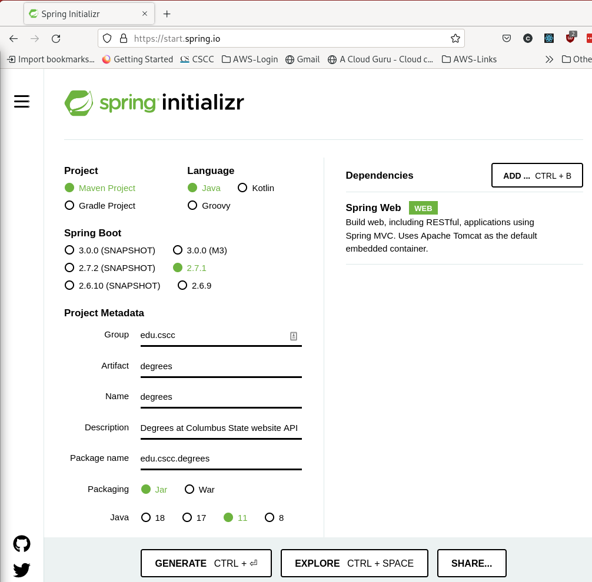
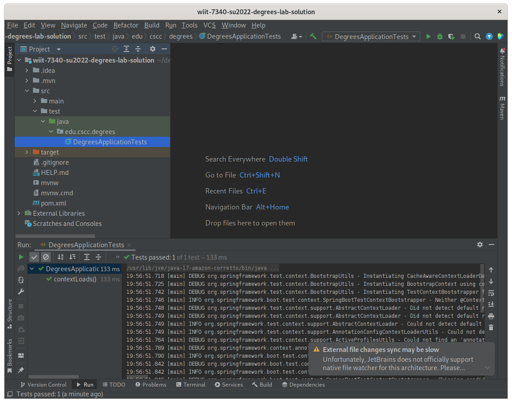
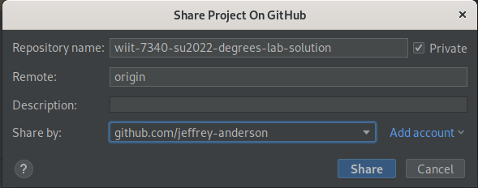
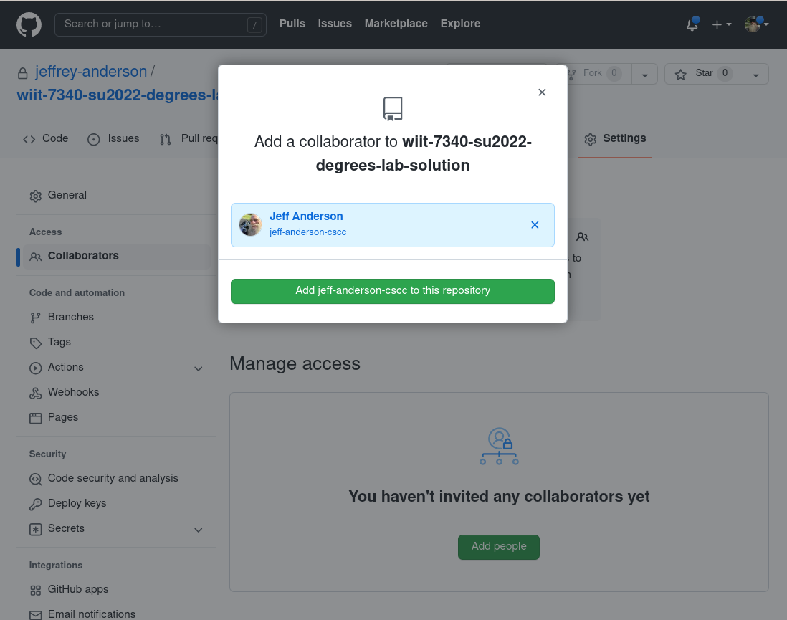

# Getting started - in-class activity

## Create the base project using start.spring.io

- [ ] Go to https://start.spring.io/ 
- [ ] Leaving the settings unchanged for project, language and Spring Boot version, use the following values for the project metadata:
  - [ ] __Group:__ `edu.cscc`
  - [ ] __Artifact:__ `degrees`
  - [ ] __Name:__ `degrees`
  - [ ] __Description:__ `Degrees at Columbus State website API`
  - [ ] __Java:__ choose version 11
- [ ] Click "ADD DEPENDENCIES", type "web" into the search field and choose `Spring Web`.
- [ ] After confirming your settings match those shown below, click "GENERATE".

## Extract the generated files

- [ ] The file should download to your `Downloads` directory, or if configured to ask, the location you choose when prompted.
- [ ] Extract the files to a directory of your choice.  I typically use a subdirectory of `$HOME/devl`.
- [ ] Start IntelliJ and close any projects that automatically open.
- [ ] From the welcome screen, choose "Open" and select the folder where you extracted the Spring Intializr starter project.
- [ ] Choose "Trust Project" and wait a few minutes for IntelliJ to download the project dependencies. 

## Verify the unit test runs
- [ ] Open the project explorer pane, navigate to the "src/test/java/edu.cscc.degrees" folder then right-click on `DegreesApplicationTests`.
- [ ] Choose "Run 'DegreesApplicationTests'".
- [ ] Verify the test succeeds as shown below:

## Commit the initial version to GitHub

- [ ] From the "VCS" menu, choose "Share project on GitHub".
- [ ] Give the repository a unique name.
- [ ] __Important:__ check "Private" to make your repository private.
- [ ] If no accounts are listed in the "Share by" field, choose "Add account," then choose "Login via GitHub."

- [ ] Leave all files selected in the "Add Files For Initial Commit" dialog and press "Add."
- [ ] Login to GitHub if necessary and verify your newly created repository is listed, is marked "Private," and has a "main" or "master" branch with the files in your project.
- [ ] Choose the "Settings" tab.
- [ ] Choose "Collaborators" under "Access" in the left navigation menu.
- [ ] Enter `jeff-anderson-cscc` (or your instructor if Jeff is not teaching) in the collaborator search field.
- [ ] Click "Add jeff-anderson-cscc to this repository".

__Congratulations! You are ready to go!__