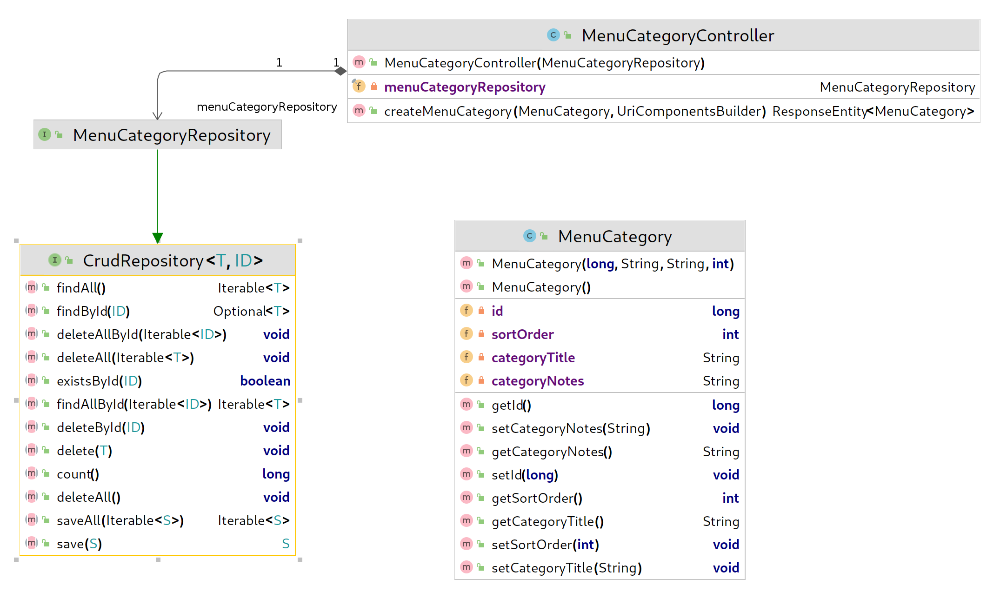

# Lab 2 - Mocks, Stubs, Entities, and Persistence

This lab checks your knowledge of the content in chapters five through seven of the *Spring Web Essentials* book.

## Before you begin

- [ ] This lab builds on the [previous one](../lab-1/README.md), so __do not start this lab__ until you have an approved pull request for Lab 1.
- [ ] Merge the changes in your Lab 1 pull request to your main (or master branch) if you have not already done so.
- [ ] Create a new branch from your main (or master) branch and switch to it before committing any changes for Lab 2.

## The Open API spec to implement

```
openapi: 3.0.0
info:
  version: '0.2'
  title: wiit-7340-degrees-at-cscc-api
  description: Specification for the Degrees restaurant at Columbus State menu
paths:
  /api/menu/categories:
    post:
      summary: Create a new menu category
      requestBody:
        description: a representation of the menu category to create
        required: true
        content:
          application/json:
            schema:
              $ref: '#/components/schemas/MenuCategory'
      responses:
        '201':
          description:
            The server created the menu category and the new instance is available at the specified location.
          headers:
            Location:
              description:
                The location of the newly created category
              schema:
                type: string
          content:
            application/json:
              schema:
                $ref: '#/components/schemas/MenuCategory'
components:
  schemas:
    MenuCategory:
      type: object
      description: Representation of a previously saved menu category
      required: [ id ]
      properties:
        id:
          type: integer
          format: int64
          description: The menu category ID which must be 0 or omitted for new instances
          default: 0
        categoryTitle:
          type: string
          description: The title of this menu category
        categoryNotes:
          type: string
          description: Notes about this menu category
        sortOrder:
          type: integer
          format: int32
          description: values used to order items for display purposes
          default: 0

```

[Click here](https://app.swaggerhub.com/apis/DataDaddy/wiit-7340_degrees_at_cscc_api/0.2) to view the spec on SwaggerHub.

## Object model of the final product

The diagram below shows the object model for the lab solution.



## Tasks

### Dependencies

- [ ] Add the following dependencies to your `pom.xml` file:
  ```
      <dependency>
        <groupId>org.springframework.boot</groupId>
        <artifactId>spring-boot-starter-data-jpa</artifactId>
      </dependency>
      <dependency>
        <groupId>com.h2database</groupId>
        <artifactId>h2</artifactId>
      </dependency>
  ```
- [ ] Right-click on your `pom.xml` file and choose "Maven > Reload Project" to refresh the project dependencies.

### Setup

- [ ] Create an `@Entity` class called `edu.cscc.degrees.domain.MenuCategory` with the properties, constructors, getters, and setters shown above.
- [ ] Create an interface called `edu.cscc.degrees.data.MenuCategoryRepository` that extends `org.springframework.data.repository.CrudRepository`

### Business logic

Using the techniques shown in chapters five through seven of the *Spring Web Essentials* book, replace the unit test(s) you created in the previous lab with one that checks the following:

* __Scenario:__ Clients can create new menu categories.
* __Given__ the menu category repository saves a new Menu Category as documented in the 
[CrudRepository.save()](https://docs.spring.io/spring-data/commons/docs/current/api/org/springframework/data/repository/CrudRepository.html#save-S-) method,
* __When__ the client performs a POST request to `/api/menu/categories`,
* __and__ the `@id` of menu category in the request body is 0,
* __and__ other menu category properties are populated,
* __then__ the controller calls the save() method __one time__ on the menu category repository,
* __and__ the menu category repository returns an updated instance with a non-zero `@id` value,
* __and__ the menu category controller returns a representation of the newly saved instance in the response body,
* __and__ the `id` property of the returned instance matches the `id` property returned by the repository `save()` method,
* __and__ the `categoryTitle` property of the returned instance matches the `categoryTitle` property returned by the repository `save()` method,
* __and__ the `categoryNotes` property of the returned instance matches the `categoryNotes` property returned by the repository `save()` method,
* __and__ the `sortOrder` property of the returned instance matches the `sortOrder` property returned by the repository `save()` method,
* __and__ the menu category controller returns a status of 201 created,
* __and__ the response contains a `Location` header with the value `http://localhost/api/menu/categories/%d` where `%d` matches the `id` property returned by the repository `save()` method.

## Notes
* Update the `MenuCategoryController` to have just enough code to get your test to pass.
* Verify the properties returned in the response body match those stubbed for the repository `save()` method.
* Verify the repository `save()` method is called exactly one time.

## Submitting your work

- [ ] Verify your tests pass.
- [ ] Commit your changes to the lab 2 branch you created.
- [ ] Push your new branch to GitHub.
- [ ] Create a pull request on the new branch.
- [ ] Add your instructor as a reviewer.
- [ ] __Wait__ for your instructor to approve your pull request before submitting your work in Blackboard.
- [ ] If changes are requested, make them and push them as extra commits on the branch you created at the start of the lab. Do *not* create a new branch or second pull request.
- [ ] __Once your instructor has approved your pull request:__
  - [ ] [Create a Git Bundle](https://git-scm.com/docs/git-bundle) of your work.
  - [ ] Submit your work in Blackboard, including both:
    1. The Git bundle you created, and 
    2. A link to the pull request based on the work.

## Before moving on to the next lab

**Once your pull request has been approved by your instructor *and* you have submitted this lab in Blackboard using the procedure above:**

- [ ] Merge your pull request to your main (or master) branch, so it has all the changes you made in this lab.
