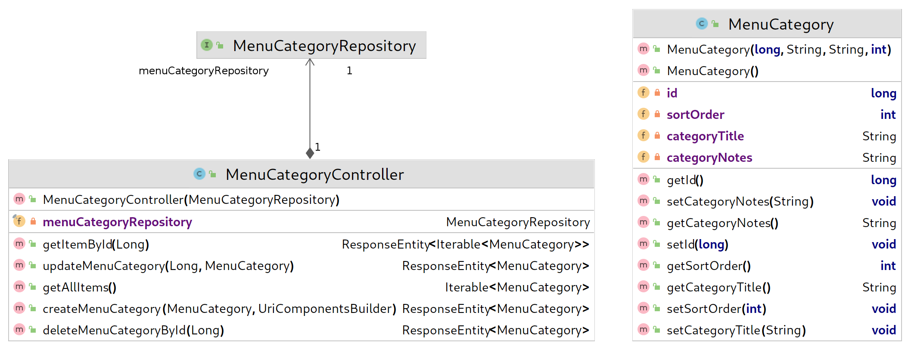

# Lab 3 - Read, Update, and Delete for our API

This lab checks your knowledge of the content in chapter eight of the *Spring Web Essentials* book.

## Before you begin

- [ ] This lab builds on the [previous one](../lab-2/README.md), so __do not start this lab__ until you have an approved pull request for Lab 2.
- [ ] Merge the changes in your Lab 2 pull request to your main (or master branch) if you have not already done so.
- [ ] Create a new branch from your main (or master) branch and switch to it before committing any changes for Lab 3.

## The Open API spec to implement

[Click here](https://app.swaggerhub.com/apis/DataDaddy/wiit-7340_degrees_at_cscc_api/0.3) to view the spec on SwaggerHub.

## Object model of the final product

The diagram below shows the object model for the lab solution.

## Tasks

Add unit tests for each scenario listed below using the techniques shown in chapter eight of the *Spring Web Essentials* book. After adding a test, add just enough code to get the test to pass.

### Get all menu categories

#### Scenario: get all returns an empty list when none exist

* __Given__ no menu categories exist in the database,
* __When__ the client performs a GET request to `/api/menu/categories`,
* __then__ the controller calls the repository [`findAll()`](https://docs.spring.io/spring-data/commons/docs/current/api/org/springframework/data/repository/CrudRepository.html#findAll--) method one time,
* __and__ the repository `findAll()` method returns an empty list,
* __and__ the controller sets the response body to the empty list returned,
* __and__ the controller sets the `contentType` of the response to `application/json`
* __and__ the menu category controller returns a status of 200 OK,
* __and__ the length of the list in the response body is 0.

#### Scenario: get all returns a non-empty list when one or more records exist

* __Given__ one or more menu categories exist in the database,
* __When__ the client performs a GET request to `/api/menu/categories`,
* __then__ the controller calls the repository [`findAll()`](https://docs.spring.io/spring-data/commons/docs/current/api/org/springframework/data/repository/CrudRepository.html#findAll--) method one time,
* __and__ the repository `findAll()` method returns an [`Iterable`](https://docs.oracle.com/javase/8/docs/api/java/lang/Iterable.html) with one or more items,
* __and__ the controller sets the response body to the list returned,
* __and__ the controller sets the `contentType` of the response to `application/json`
* __and__ the menu category controller returns a status of 200 OK,
* __and__ the length of the list in the response body equals the length of the list returned by the `findAll()` method,
* __and__ for each item in the response body list:
  * __the__ `id` property of the returned instance matches the `id` property of the corresponding item returned by the repository `findAll()` method,
  * __and__ the `categoryTitle` property of the returned instance matches the `categoryTitle` property of the corresponding item returned by the repository `findAll()` method,
  * __and__ the `categoryNotes` property of the returned instance matches the `categoryNotes` property of the corresponding item returned by the repository `findAll()` method,
  * __and__ the `sortOrder` property of the returned instance matches the `sortOrder` property of the corresponding item returned by the repository `findAll()` method.

### Get menu category by ID

#### Scenario: get by ID returns a list with one item when it exists in the database

* __Given__ the client is attempting to retrieve a record that exists in the database,
* __when__ the client performs a GET request to `/api/menu/categories/%d` where `%d` is any positive non-zero value,
* __and__ the controller calls the repository [`findById()`](https://docs.spring.io/spring-data/commons/docs/current/api/org/springframework/data/repository/CrudRepository.html#findById-ID-) method one time,
* __and__ the repository `findById()` method returns a `MenuCategory` with then given ID,
* __and__ the controller sets the response body to a singleton list with the item returned,
* __and__ the controller sets the `contentType` of the response to `application/json`
* __then__ the menu category controller returns a status of 200 OK,
* __and__ the length of the list in the response body equals 1,
* __and__ for the single item in the response body list:
  * __the__ `id` property of the returned instance matches the `id` property of the corresponding item returned by the repository `findById()` method,
  * __and__ the `categoryTitle` property of the returned instance matches the `categoryTitle` property of the corresponding item returned by the repository `findById()` method,
  * __and__ the `categoryNotes` property of the returned instance matches the `categoryNotes` property of the corresponding item returned by the repository `findById()` method,
  * __and__ the `sortOrder` property of the returned instance matches the `sortOrder` property of the corresponding item returned by the repository `findById()` method.

#### Scenario: get by ID returns a 404 not found when the requested item does not exist in the database

* __Given__ the client is attempting to retrieve a record that does not exist in the database,
* __when__ the client performs a GET request to `/api/menu/categories/%d` where `%d` is any positive non-zero value,
* __and__ the controller calls the repository [`findById()`](https://docs.spring.io/spring-data/commons/docs/current/api/org/springframework/data/repository/CrudRepository.html#findById-ID-) method one time,
* __and__ the `findById()` method returns an [`Optional.empty()`](https://docs.oracle.com/en/java/javase/11/docs/api/java.base/java/util/Optional.html#empty()),
* __then__ the menu category controller returns a status of 404 not found.

### Update a menu category

#### Scenario: saving an updated record succeeds when the record exists in the database

* __Given__ the client is attempting to update a record that exists in the database,
* __when__ the client performs a PUT request to `/api/menu/categories/%d` where `%d` is any positive non-zero value,
* __and__ the request body contains a representation of a `MenuCategory`,
* __and__ the controller calls the repository [`existsById()`](https://docs.spring.io/spring-data/commons/docs/current/api/org/springframework/data/repository/CrudRepository.html#existsById-ID-) method one time passing in the ID included in the URL,
* __and__ the `existsById()` method returns `true`,
* __then__ the controller calls the `save()` method on the repository one time passing a menu category instance with all properties equal to those provided in the request body,
* __and__ the `save()` method returns an updated version of the saved record,
* __and__ the menu category controller returns a status of 204 no content.

#### Scenario: saving an updated record fails when the record does not exist in the database

* __Given__ the client is attempting to update a record that does not exists in the database,
* __when__ the client performs a PUT request to `/api/menu/categories/%d` where `%d` is any positive non-zero value,
* __and__ the request body contains a representation of a `MenuCategory`,
* __and__ the controller calls the repository [`existsById()`](https://docs.spring.io/spring-data/commons/docs/current/api/org/springframework/data/repository/CrudRepository.html#existsById-ID-) method one time passing in the ID included in the URL,
* __and__ the `existsById()` method returns `false`,
* __then__ the controller does **not** call the `save()` method on the repository,
* __and__ the menu category controller returns a status of 404 not found.

### Delete a menu category

#### Scenario: delete succeeds when the record exists in the database

* __Given__ the client is attempting to delete a record that exists in the database,
* __when__ the client performs a DELETE request to `/api/menu/categories/%d` where `%d` is any positive non-zero value,
* __and__ the controller calls the repository [`findById()`](https://docs.spring.io/spring-data/commons/docs/current/api/org/springframework/data/repository/CrudRepository.html#findById-ID-) method one time passing in the ID included in the URL,
* __and__ the repository `findById()` method returns a `MenuCategory` with then given ID,
* __then__ the controller calls the `delete()` method on the repository one time passing the instance returned by `findById()`,
* __and__ the menu category controller returns a status of 204 no content.

#### Scenario: attempt to delete nonexistent record fails with a 404

* __Given__ the client is attempting to delete a record that exists in the database,
* __when__ the client performs a DELETE request to `/api/menu/categories/%d` where `%d` is any positive non-zero value,
* __and__ the controller calls the repository [`findById()`](https://docs.spring.io/spring-data/commons/docs/current/api/org/springframework/data/repository/CrudRepository.html#findById-ID-) method one time passing in the ID included in the URL,
* __and__ the `findById()` method returns an [`Optional.empty()`](https://docs.oracle.com/en/java/javase/11/docs/api/java.base/java/util/Optional.html#empty()),
* __then__ the menu category controller returns a status of 404 not found.
* __and__ the controller does **not** call the `delete()` method on the repository.

## Notes
* Check the values of all properties returned by the controller match those returned by the stubbed repository methods. 
* Verify all interactions with the repository methods.

## Submitting your work

- [ ] Verify your tests pass.
- [ ] Commit your changes to the lab 3 branch you created.
- [ ] Push your new branch to GitHub.
- [ ] Create a pull request on the new branch.
- [ ] Add your instructor as a reviewer.
- [ ] __Wait__ for your instructor to approve your pull request before submitting your work in Blackboard.
- [ ] If changes are requested, make them and push them as extra commits on the branch you created at the start of the lab. Do *not* create a new branch or second pull request.
- [ ] __Once your instructor has approved your pull request:__
  - [ ] [Create a Git Bundle](https://git-scm.com/docs/git-bundle) of your work.
  - [ ] Submit your work in Blackboard, including both:
    1. The Git bundle you created, and 
    2. A link to the pull request based on the work.

## Before moving on to the next lab

- [ ] Merge your pull request to your main (or master) branch, so it has all the changes you made in this lab.
