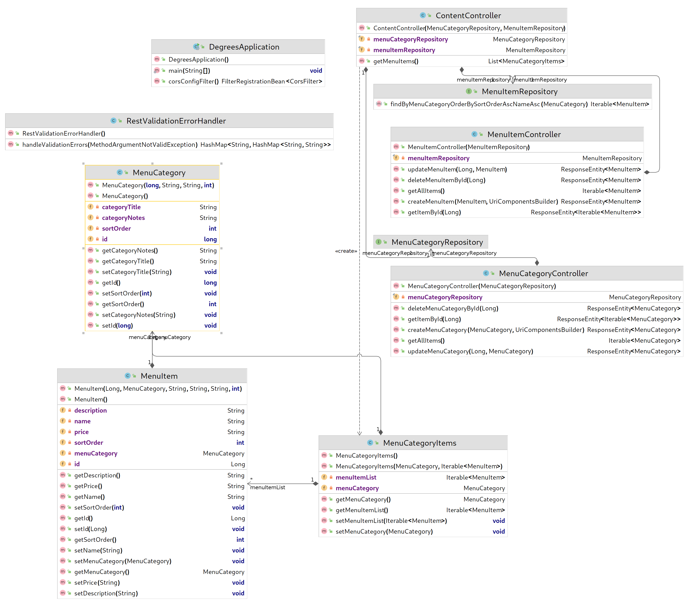

# Lab 5 - Connecting the Front End Application

In this lab, we get our Vue web application front end working, add in CORS support so it can access our API, and create a controller to serve our dynamic content. 

This lab checks your knowledge of the content in chapters 9 and 12 of the *Spring Web Essentials* book.

## Before you begin

- [ ] This lab builds on the [previous one](../lab-4/README.md), so __do not start this lab__ until you have an approved pull request for Lab 4.
- [ ] Merge the changes in your Lab 4 pull request to your main (or master branch) if you have not already done so.
- [ ] Create a new branch from your main (or master) branch and switch to it before committing any changes for Lab 5.


## Object model of the final product

The diagram below shows the object model for the lab solution.



## Tasks

This assignment has three parts:

- [ ] Create a `Content` controller that returns a displayable menu list 
- [ ] Get the Vue web application running
- [ ] Using the techniques described in *Spring Web Essentials*, Chapter 11, *Connecting a Single Page Application (SPA)*, add [CORS](https://www.w3.org/TR/cors/) support, so the web application can interact with our API

### Create the Content controller that returns a displayable menu list

In this step, you will create a controller that provides a public API used by clients to get a displayable menu.

For more on the query methods we are adding, read Working with Spring Data Repositories:
* [4.1 Core concepts](https://docs.spring.io/spring-data/jpa/docs/current/reference/html/#repositories.core-concepts)
* [4.4.2. Query Creation](https://docs.spring.io/spring-data/jpa/docs/current/reference/html/#repositories.query-methods.query-creation)
* [4.4.3. Property Expressions](https://docs.spring.io/spring-data/jpa/docs/current/reference/html/#repositories.query-methods.query-property-expressions)

#### Modify the Spring JPA repositories to support new queries

- [ ] Change `edu.cscc.degrees.data.MenuCategoryRepository` so it extends [PagingAndSortingRepository](https://docs.spring.io/spring-data/commons/docs/current/api/org/springframework/data/repository/PagingAndSortingRepository.html) rather than CrudRepository.  This will allow us to use the Spring [Sort](https://docs.spring.io/spring-data/commons/docs/current/api/org/springframework/data/domain/Sort.html) class to order query results returned by findAll().
- [ ] Using the techniques described in section [4.4.2. Query Creation](https://docs.spring.io/spring-data/jpa/docs/current/reference/html/#repositories.query-methods.query-creation), add a query method to `edu.cscc.degrees.data.MenuItemRepository` that does find by menu category and orders by sort order ascending, name ascending.
<details>
  <summary>TLDR; just show me the code</summary>
  
```
Iterable<MenuItem> findByMenuCategoryOrderBySortOrderAscNameAsc(MenuCategory category);
```
</details>

#### Create the new controller and return type

 

Using the class diagram above as a guide, create these two classes in the `edu.cscc.degrees.api` package:

- [ ] First, `MenuCategoryItems` which holds one menu category and the list of menu items for that category.
- [ ] Next, a `@RestController` named `ContentController` that has a `@GetMapping("/public/api/menus")` method called `getMenuItems` which returns a list of `MenuCategoryItems` (details below).


- [ ] Implement the `getMenuItems` method using the logic shown in the sequence diagram above. Specifically:

    1. Create a new `ArrayList` to hold a list of `MenuCategoryItems`.  You will return this list at the end of the method.
    1. Get a list of menu categories by calling `menuCategoryRepository.findAll` sorted by `sortOrder` and `categoryTitle`.
    1. Loop over the categories returned and:
        1. Create a new instance of `MenuCategoryItems`.
        1. In the new instance, set the `menuCategory` to the current category.
        1. Call our new query method in `menuItemRepository` passing in the current category.
        1. In the new `MenuCategoryItems` instance, set the `menuItemList` to the results of the query in the step above. 
        1. Add the new `MenuCategoryItems` instance to the array list we are returning.

<details>
  <summary>Wow, that diagram is crazy! Just show me the code</summary>
  
```
  @GetMapping("/public/api/menus")
  public List<MenuCategoryItems> getMenuItems() {
    ArrayList<MenuCategoryItems> returnList = new ArrayList<>();

    Iterable<MenuCategory> menuCategories =
      menuCategoryRepository.findAll(Sort.by("sortOrder","categoryTitle"));

    for (MenuCategory menuCategory : menuCategories) {
      MenuCategoryItems menuCategoryItems = new MenuCategoryItems();
      menuCategoryItems.setMenuCategory(menuCategory);
      menuCategoryItems.setMenuItemList(menuItemRepository
        .findByMenuCategoryOrderBySortOrderAscNameAsc(menuCategory));
      returnList.add(menuCategoryItems);
    }

    return returnList;
  }
```
</details>

#### Configure Spring to use port 3000

- [ ] Reconfigure Spring to use port 3000 using the same procedure from the beginning of chapter 11 in the book.
- [ ] Start or restart the application and make sure it comes up on port 3000. \
    `Tomcat started on port(s): 3000 (http) with context path ''`
- [ ] Stop the application after you verify it runs on port 3000.


#### Add sample data to your database

__Important:__ Before you can populate your database, the tables need to exist. For this to happen:
- [ ] Run all your unit tests and make sure they all are passing.
- [ ] Activate the postgres profile as discussed in *Run our application using the postgres profile* from chapter 10, *Spring Profiles and external databases*.
- [ ] Start the application and make sure you see, `The following profiles are active: postgres`, in the log output.

Once you have completed the steps above, Hibernate will have created the tables in your database.

- [ ] Using DBeaver, run the SQL below to populate the database with menu categories and items for the website:

```sql
truncate menu_item;
truncate menu_category cascade;

insert into menu_category (category_title, sort_order, category_notes) 
values 
  ('Starters', 10, null),
  ('Shellfish', 30, null),
  ('Sandwiches', 20, 'Served with sea salt and pepper fries, house greens, or soup of the day'),
  ('ENTRÉES', 60, null),
  ('ENTRÉE SALADS', 50, null),
  ('Desserts', 80, null),
  ('Flatbread', 40, null),
  ('Sides', 70, null);

insert into menu_item (menu_category_id, name, description, price, sort_order)
values
  ((select id from menu_category where category_title = 'Starters'), 'House-Made Ricotta', 'peach preserves, sourdough toast', '7', 1), 
  ((select id from menu_category where category_title = 'Starters'), 'WARM CHEDDAR BISCUITS', 'pimento butter', '6', 2),
  ((select id from menu_category where category_title = 'Starters'), 'HOUSE-CURED SALMON', 'rye toast, egg salad, pickled onion', '9', 3),
  ((select id from menu_category where category_title = 'Starters'), 'SOUP OF THE DAY', 'chef’s selection', '4 | 6', 5),
  ((select id from menu_category where category_title = 'Starters'), 'CHICKEN MEATBALLS', 'sweet ‘n sour, lime, crushed peanuts', '8', 4),
  ((select id from menu_category where category_title = 'Shellfish'), 'SHRIMP COCKTAIL', null, '11', 0),
  ((select id from menu_category where category_title = 'Shellfish'), 'SHRIMP ‘N GRITS', 'roasted poblano, tomato pan sauce', '13', 0),
  ((select id from menu_category where category_title = 'Shellfish'), 'OYSTERS ON THE HALF SHELL', null, '9', 0),  
  ((select id from menu_category where category_title = 'Shellfish'), 'BAKED OYSTERS', 'chorizo, scallion', '11', 0),
  ((select id from menu_category where category_title = 'Sandwiches'), 'CHEESEBURGER*', 'ground daily, aged Cheddar, LTO, sweet pickle mayo', '12', 0),
  ((select id from menu_category where category_title = 'Sandwiches'), 'FRIED CHICKEN HAVARTI', 'Havarti, cole slaw, sweet banana peppers', '13', 0),
  ((select id from menu_category where category_title = 'Sandwiches'), 'SMOKED TURKEY GRINDER', 'mozzarella, iceberg, onion, red wine vinaigrette', '12', 0),
  ((select id from menu_category where category_title = 'Sandwiches'), 'GRILLED CHEESE', 'brie, mushroom duxelles, walnut pesto, sage, apple jam', '11', 0),
  ((select id from menu_category where category_title = 'ENTRÉES'), 'BRAISED CHICKEN', 'cheddar grits, glazed root vegetables, roasted garlic jus', '15', 0),
  ((select id from menu_category where category_title = 'ENTRÉES'), 'PAN-SEARED SALMON*', 'roasted Brussels, sweet potatoes, pecans, pomegranate vinaigrette', '18', 0),
  ((select id from menu_category where category_title = 'ENTRÉES'), 'FISH ‘N CHIPS', 'Atlantic cod, beer batter, smashed rosemary fingerling potatoes', '14', 0),
  ((select id from menu_category where category_title = 'ENTRÉES'), 'HANDMADE PASTA', 'toasted garlic, hand crushed tomatoes, mushrooms, burrata, basil', '14', 0),
  ((select id from menu_category where category_title = 'ENTRÉES'), 'SHORT RIB', 'seared polenta cake, broccolini, swiss chard, natural jus', '19', 0),
  ((select id from menu_category where category_title = 'ENTRÉE SALADS'), 'SALMON CAESAR', 'romaine, lemon, Parmesan, garlic croutons', '13', 0),
  ((select id from menu_category where category_title = 'ENTRÉE SALADS'), 'CHOPPED', 'iceberg, black kale, avocado, corn, dates, Brioche crouton, almonds, white balsamic vinaigrette', '11', 0),
  ((select id from menu_category where category_title = 'ENTRÉE SALADS'), 'COLUMBUS COBB', 'smoked turkey, avocado, tomato, egg, bacon, blue cheese', '14', 0),
  ((select id from menu_category where category_title = 'ENTRÉE SALADS'), 'THAI STEAK*', 'marinated flatiron steak, buckwheat noodles, mango, cucumber, edamame, sesame vinaigrette', '15', 0),
  ((select id from menu_category where category_title = 'ENTRÉE SALADS'), 'TRIO', 'half chicken salad sandwich, soup of the day, and house greens', '11', 0),
  ((select id from menu_category where category_title = 'Desserts'), 'CARROT CAKE', null, '6', 0),
  ((select id from menu_category where category_title = 'Desserts'), 'CHOCOLATE ESPRESSO TORTE', null, '7', 0),
  ((select id from menu_category where category_title = 'Desserts'), 'CRÈME BRÛLÉE', null, '6', 0),
  ((select id from menu_category where category_title = 'Flatbread'), 'MARGHERITA', 'mozzarella, burrata, tomato, basil', '11', 0),
  ((select id from menu_category where category_title = 'Flatbread'), 'VEGETABLE', 'mushroom, artichoke, feta, olive, pesto', '12', 0),  
  ((select id from menu_category where category_title = 'Flatbread'), 'PEPPERONI', 'marinara, red onion, Provolone', '12', 0),
  ((select id from menu_category where category_title = 'Sides'), 'BEETS AND PICKLED BLUEBERRY SALAD', null, '4', 0),
  ((select id from menu_category where category_title = 'Sides'), 'SEA SALT AND PEPPER FRIES', null, '4', 0),
  ((select id from menu_category where category_title = 'Sides'), 'POMEGRANATE BRUSSELS SPROUTS', null, '5', 0);
```

#### Check your work via Postman 
      
__Important: because we changed the server port from 8080 to 3000, update the request URL for all your saved Postman requests.__  If you see HTML in the response, the request is going to port 8080 instead of 3000.

- [ ] Issue a `GET` request to `localhost:3000/public/api/menus`. The response should look like this: 


### Get the Vue web application running

For reference, see *Spring Web Essentials*, Chapter 11, *Connecting a Single Page Application (SPA)*.

#### Install NodeJS  

- [ ] If you don't already have Node.js installed, [download](https://nodejs.org/en/download/) and install the current long term support (LTS) version. 

  __NOTE:__ If you are using the Columbus State provided VM: in a terminal window, run: `node --version` and make sure you have at least version 16.10 installed. If not, run the following commands to upgrade your version of node: 

  ```
  sudo yum remove nodejs -y
  curl -o- https://raw.githubusercontent.com/nvm-sh/nvm/v0.39.1/install.sh | bash

  --- Open a NEW terminal window  ----

  nvm install --lts
  node --version
  ```
  It should print out something like: v16.15.1. The actual version may differ slightly, but it should start with v16

- [ ] Finally, run `corepack enable` to make the `yarn` package manager available.

#### Download and run the web front end application 

To get the web front end application running locally on your machine:

- [ ] Clone [https://github.com/ColumbusStateWorkforceInnovation/wiit-7340-degrees-vue-3-app](https://github.com/ColumbusStateWorkforceInnovation/wiit-7340-degrees-vue-3-app.git) into a directory of your choice. 
- [ ] Change into the top level directory of the repo you just cloned.
- [ ] Install the dependencies by running `yarn install`. This may take some time.
- [ ] Run `yarn serve` to launch the application.
- [ ] Once everything is running, open your browser and visit [http://localhost:8080/#/menu](http://localhost:8080/#/menu).

At this point, you should see the Degrees at Columbus State website with no menu items. 

### Add CORS support

#### Verify CORS is blocking use of the API

- [ ] Open the developer tools in your browser.  If you are using Chrome, [click here for instructions](https://developers.google.com/web/tools/chrome-devtools/) or [here if you are using Firefox](https://developer.mozilla.org/en-US/docs/Tools/Tools_Toolbox). 
- [ ] With the dev tools open, switch to the __Console__ tab. 
- [ ] Refresh the page in your browser. You will briefly see a "Loading...." message. After it goes away, notice the errors in the console

### Configuring our API to allow access

- [ ] Add the following code to the `DegreesApplication`:

```java
@Bean
public FilterRegistrationBean<CorsFilter> corsConfigFilter() {
    UrlBasedCorsConfigurationSource source
        = new UrlBasedCorsConfigurationSource();
    CorsConfiguration config = new CorsConfiguration();
    config.setAllowCredentials(true);
    config.setAllowedOrigins(
        Collections.singletonList("http://localhost:8080"));
    config.setAllowedMethods(Collections.singletonList("*"));
    config.setAllowedHeaders(Collections.singletonList("*"));
    config.addExposedHeader("Location");
    source.registerCorsConfiguration("/api/**", config);
    source.registerCorsConfiguration("/public/api/**", config);
    FilterRegistrationBean<CorsFilter> bean =
        new FilterRegistrationBean<>(new CorsFilter(source));
    bean.setOrder(Ordered.HIGHEST_PRECEDENCE);
    return bean;
}
```

This code is identical to the example in the book with one additional path for `/public/api/**`.

- [ ] Restart the Degrees application
- [ ] After it comes up, refresh your browser and verify the menu appears:


## Submitting your work

- [ ] Verify your tests pass.
- [ ] Commit your changes to the lab 5 branch you created.
- [ ] Push your new branch to GitHub.
- [ ] Create a pull request on the new branch.
- [ ] Add your instructor as a reviewer.
- [ ] __Wait__ for your instructor to approve your pull request before submitting your work in Blackboard.
- [ ] If changes are requested, make them and push them as extra commits on the branch you created at the start of the lab. Do *not* create a new branch or second pull request.
- [ ] __Once your instructor has approved your pull request:__
  - [ ] [Create a Git Bundle](https://git-scm.com/docs/git-bundle) of your work.
  - [ ] Submit your work in Blackboard, including both:
    1. The Git bundle you created, and 
    2. A link to the pull request based on the work.

## Before moving on to the next lab

**Once your pull request has been approved by your instructor *and* you have submitted this lab in Blackboard using the procedure above:**

- [ ] Merge your pull request to your main (or master) branch, so it has all the changes you made in this lab.
